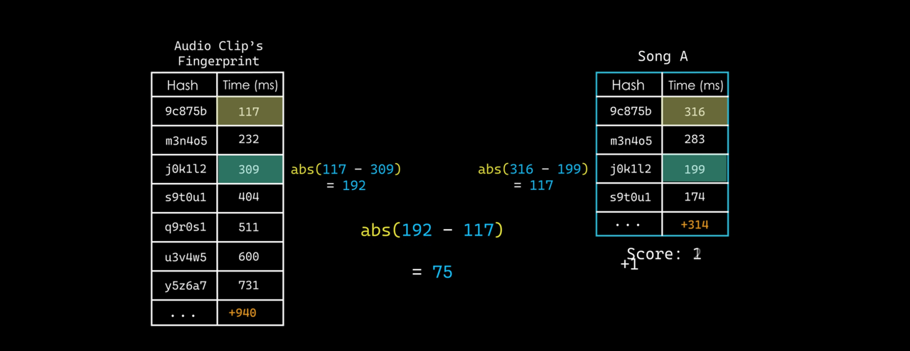

# song_recognizer

### External Interface

Purely command line. Might be a Rust import to handle command line inputs.

Executing the program without arguments runs the program in "continuous" 
mode where it listens on the microphone for XXX time until it identifies a song 
or returns "No Found." 

< Flags >
--add / -a <file_name> : adds a song to the database using file_name 
-id / -i <file_name> : try to identify a song from file_name

Flags don't have to be mutually exclusive. If both are present, always add 
to database before identifying a song.

### Control Flow

    Time Domain -> Frequency Domain 
Down sample the audio signal to around 12 kHz, cut out signals outside [20 Hz,
5 kHz]

Hamming window function to taper edges of signal that is segmented 

FFT on each signal piece and lay it out in a 2D matrix (? don't know why but 
might want to just make it a 1D array) 

    Amplitude-Based Identification
Find the loudest (highest amplitude) frequencies in each of the frequency bands

Very Low: 0 - 10
Low: 10 - 20
Low-Mid: 20 - 40
Mid: 40 - 80
Mid-High: 80 - 160
High: 160 - 511

After, for each time slice, calculate the average of the six values and 
remove any values below the average. (might be useful here to convert the 
data into a struct?)

    Fingerprinting
For each time slice

For each point in a time slice, treat it as an anchor. Find five nearest 
neighbors within a target zone (TBD). For each anchor target pair, make a 
struct containing the anchor's frequency, the target's frequency, and target 
time minus anchor time. 

Make this struct the hash value (key) (TBD: find a way to compact this data) 
for a map that maps the hash value struct to an array of tuples (anchor point 
time, song name). SAVE TO DB

    Identification
From input, convert to wave format. Then, process it to get the hash values 
and the times the hash value occurred. Query the database for all 
fingerprint tuples that match the hash

Organize the results by Song into a table of Hash | Time, organized by hash 
matching the audio clip. For the audio clip and a matching Song:
    from the first matching hash (top of table) and the subsequent hash (a 
hash that matches), compute the absolute time difference. Then compare the times 
between the audio clip and the Song from the DB. If less than 100, increase 
the Match score for the Song. Keep pointing at the first table entry and 
increment to the next (matching) hash, performing the same differences.

    Note: the size of the audio clip vs Song tables may be different so act 
accordingly.

The highest score will be the best match

diesel::table! {
fingerprints (hash, anchor_time_ms, song_id) {
hash -> Integer,
anchor_time_ms -> Integer,
song_id -> Integer,
}
}

diesel::table! {
songs (id) {
id -> Integer,
title -> Text,
artist -> Text,
spotify_uri -> Text,
song_key -> Text,
}
}

